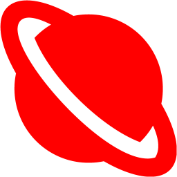

# 🌏Planet Magic



## Online Magic Shop Landing Page
[Visit Live Site](https://yourusername.github.io/planet-magic) | [Report Bug](https://github.com/yourusername/planet-magic/issues) | [Request Feature](https://github.com/yourusername/planet-magic/issues)

## ✨ Features
- **A very basic layout indeed. Feel free to add new features, add add interectivity or update the existing ones!

## 🖼️ Screenshots


## 🛠️ Built With
- HTML5
- CSS3
- Custom UI components
- Google Fonts (Orbitron, Montserrat, Open Sans)


## 🚀 Getting Started

To get a local copy up and running, follow these simple steps:
1. Clone the repo
   ```sh
   git clone https://github.com/yourusername/planet-magic.git
   ```
2. Open `index.html` in your browser


## 🔄 Suggested Roadmap
- [ ] Add JavaScript functionality for cart operations.
- [ ] Implement product search functionality.
- [ ] Add user authentication.
- [ ] Create product detail pages.
- [ ] Any thing else you do wish.

See the [open issues](https://github.com/yourusername/planet-magic/issues) for a full list of proposed features and known issues.


## 🤝 Contributing Together
Contributions make the open-source community an amazing place to learn, inspire, and create. Any contributions you make are **greatly appreciated**.
1. Fork the Project
2. Create your Feature Branch (`git checkout -b feature/AmazingFeature`)
3. Commit your Changes (`git commit -m 'Add some AmazingFeature'`)
4. Push to the Branch (`git push origin feature/AmazingFeature`)
5. Open a Pull Request


## 📄 License
Distributed under the MIT License. See `LICENSE` for more information.

## 📞 Contact
Your Name - [@yourtwitter](https://twitter.com/yourtwitter) - email@example.com
Project Link: [https://github.com/yourusername/planet-magic](https://github.com/yourusername/planet-magic)

## 🙏 Acknowledgments
* [Font Awesome](https://fontawesome.com) for icons
* [Google Fonts](https://fonts.google.com) for typography
* [Unsplash](https://unsplash.com) for stock images
* [Pixels](https://www.pexels.com/) for stock images
